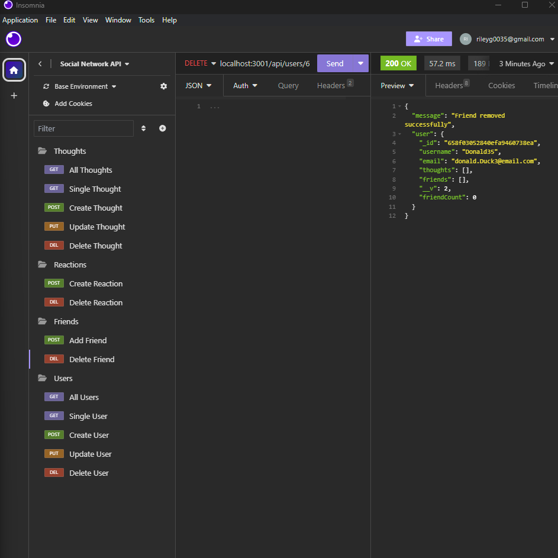

# Social-Network-API

## Description
In this project, I have created a "Social Network API" to run requests in the application, "Insomnia". Using the back-end we can create users, thoughts and add friends. This API also includes the ability to delete/update said users, thoughts and friends. As a database, MongooseDB Compass keeps track of all our data structured between "Thought" and "User" models. 

### Installation
From the "Social-Network-API" repository (https://https://github.com/RG-GitUser/Social-Network-API) select the "Code" dropdown.
Using the "Code" dropdown, click on "SSH".
On the "SSH" tab, select the "copy" button next to the address.
Next, open your git bash terminal (or for mac users, homebrew)
Use the command "git clone" and "insert coppied SSH key here" then press enter.
Enter the "cd "enter path here" " command to navigate to the correct directory.
You now have the repository cloned to your system! To verify, the command "ls" to view the items listed inside of the repository.

### Usage

From the backend, users are able to create, update and delete thoughts, users and friends. To test our API, we send requests through the "Insomnia" application. 

### Screenshot: 

()

### Credits
full stack Xpert Learning Assistant

devdocs.io: https://devdocs.io

youtube.com
